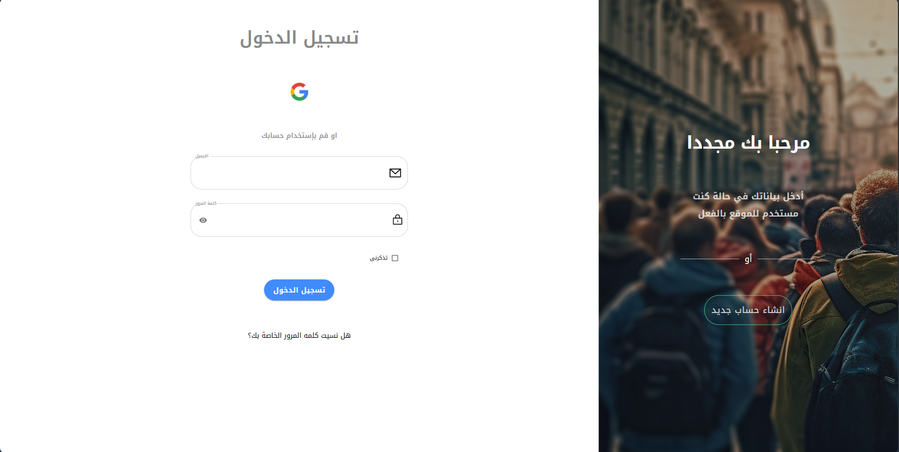
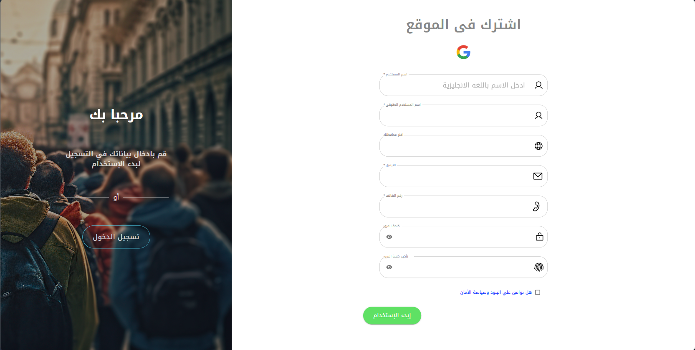
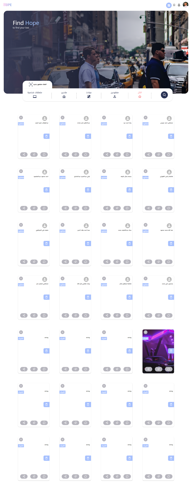
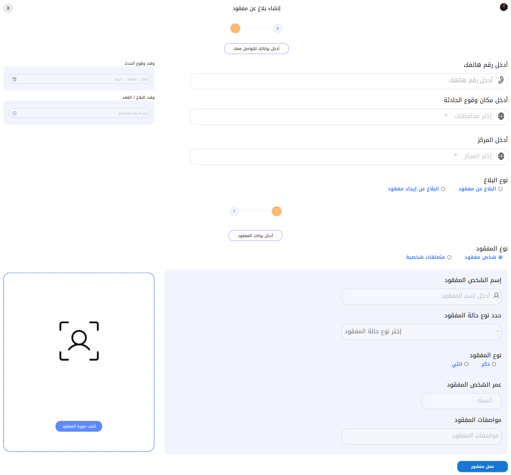
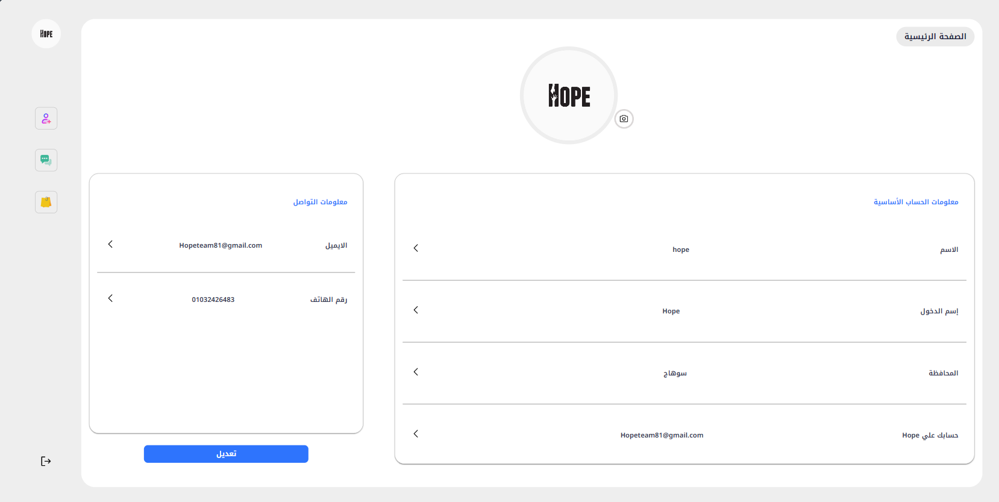
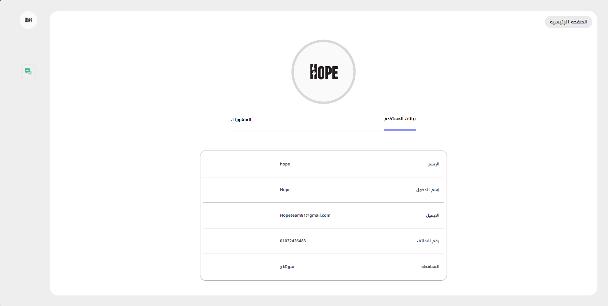
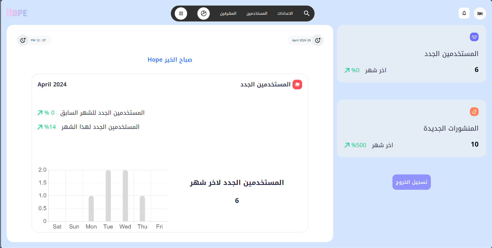
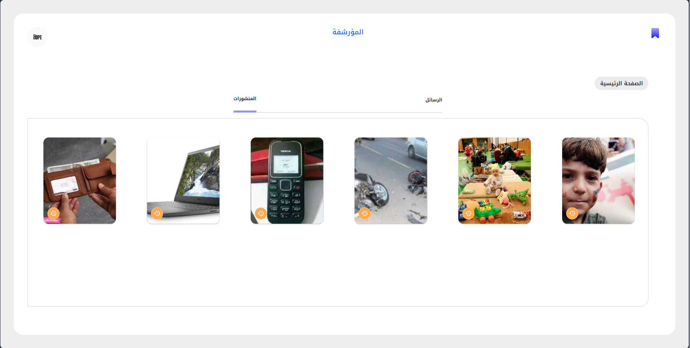

## Social Service Website for Missing Persons and Things using AI

As the project leader and Front End Developer for my graduation project, I led the development of a social service website with the following key features:

### Features

- **Register with Email Verification:** Ensure secure registration with email verification.

- **Login with Password Recovery:** Convenient login with password recovery options.

- **Home Page Contains:**
  - Navbar.
  - Hero section.
  - Search bar for searching for users.
  - A navigation bar to move between the posts classified as follows:
    - All posts
    - Accidents
    - Missing persons
    - Shelters
    - Things
  - Create post button.

- **Post Creation Page Divided As Follows:**
  - Create post for people.
  - Create post for things.

- **Posts:**
  - Post body appears on the home page.
  - Post details when clicked on the post body.
  - Can share a post.
  - Comment on a post.
  - Can reply to the comment.
  - Can delete the comment.
  - Can edit the comment.
  - Can delete the reply.
  - Can edit the reply.
  - Can hide/unhide the post.
  - Can pin/unpin the post.
  - Can delete the post if you created it, and the admin can delete any post too.

- **Archive Page Contains:**
  - The hidden posts.
  - The deleted messages.

- **Other Users' Profile Page Contains:**
  - User data.
  - All posts that this user created.

- **My Profile Page Contains:**
  - My data.
  - Can edit my data.
  - Can logout.
  - All posts that I created.
  - Edit the post data.
  - Delete the post.
  - My pinned posts and can unpin them.
  - My hidden posts and can unhide them.
  - Realtime chat.

- **Chatbot Contains:**
  - Create a post faster than the traditional way.
  - Search for a lost person quickly and get recommended places for search.
  - Search for a lost person inside the nearest hospital to their location.
  - Give advice to users and calm them down.

- **Notification System Contains:**
  - Notice when creating a post near me through a recommendation system and face recognition.
  - Notice when you make a comment or reply to a comment.
  - Notification when receiving a message from a user.
  - Notification of the two new updates on the site.

- **Dashboard Contains:**
  - Statistics about posts.
  - Statistics about users.
  - General statistics at the website.
  - All users' accounts (can delete any user and can set any user as an admin).
  - All admins (can delete any admin).
  - Can create a new admin account.
  - Notes to admin.
  - Reports for admins.

### Screenshots
Here are some screenshots of the project:

### Live Demo
Check out the live demo of the website [here](https://hope-social.vercel.app/).

### Video Demonstration
Watch a video demonstration of the project [here](https://www.linkedin.com/posts/saeed-ramadan-686186201_hope-graduationproject-socialservice-activity-7210713850185216000-5C8H?utm_source=share&utm_medium=member_desktop).
